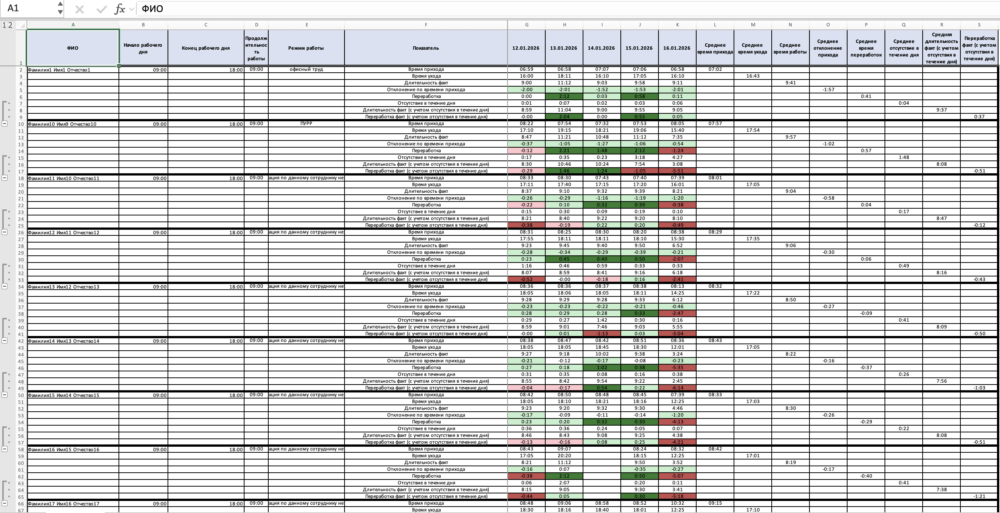

# AttendanceScript: автоматизация учета посещаемости и отчетности по сотрудникам

## Задача

Руководству нужен прозрачный, воспроизводимый и единообразный отчет по посещаемости: кто когда приходил и уходил, сколько фактически работал, есть ли переработки и отклонения от нормы. Ручная сборка из разных Excel-файлов занимает время, дает ошибки и не масштабируется.

## Решение

AttendanceScript - утилита на Python, которая собирает данные из каталога с исходными файлами (поддерживаются разные форматы входа), агрегирует события по сотрудникам и дням, строит итоговый Excel-отчет с формулами и визуальной подсветкой, а также выводит аналитические списки (например, топ по среднему времени работы с фильтром по режиму работы).

Проект ориентирован на повторяемый процесс: один раз настроили входную папку - получили готовый отчет и метрики без ручной сводки.

## Ключевые возможности

- Единый конвейер "папка -> отчет": парсинг -> агрегация -> генерация `.xlsx`.
- Поддержка нескольких форматов входных данных (в т.ч. legacy `.xls` и табличные `.xlsx`).
- Учет отсутствий в течение дня с двумя режимами логики:
  - если нет явного признака входа/выхода - используется модель чередования событий;
  - если в данных есть поле направления (`EntryExit`: "Вход"/"Выход") - отсутствия считаются по фактическим выходам/возвратам.
- Режим работы сотрудника подтягивается из отдельного справочника (`Режим работы.xlsx` / `Режимы работы.xlsx`) и отображается в отчете; при отсутствии данных - понятные сообщения для аудита.
- Наглядный Excel-отчет:
  - формулы для производных показателей;
  - условное форматирование отклонений и переработок;
  - группировка строк (outline) для быстрого скрытия/показа блока расчетов "с учетом отсутствия".
- Аналитика в консоли: топ списков по среднему времени работы с фильтром только "офисный труд" - удобно для оперативных выводов без открытия Excel.

## Ценность для бизнеса

- Экономия времени HR/руководителя: минуты вместо часов на подготовку сводки.
- Снижение ошибок: единые правила расчета, прозрачные допущения, воспроизводимый результат.
- Улучшение управляемости: видимость переработок, отклонений, отсутствий в течение дня, сопоставление с режимом работы.
- Масштабируемость: добавление новых файлов в папку не требует переделки процесса.

## Пример (данные обезличены)

## Технологический стек

- Python 3
- openpyxl / xlrd для чтения Excel
- Модульная структура: парсеры -> модели -> агрегатор -> генератор отчета -> CLI